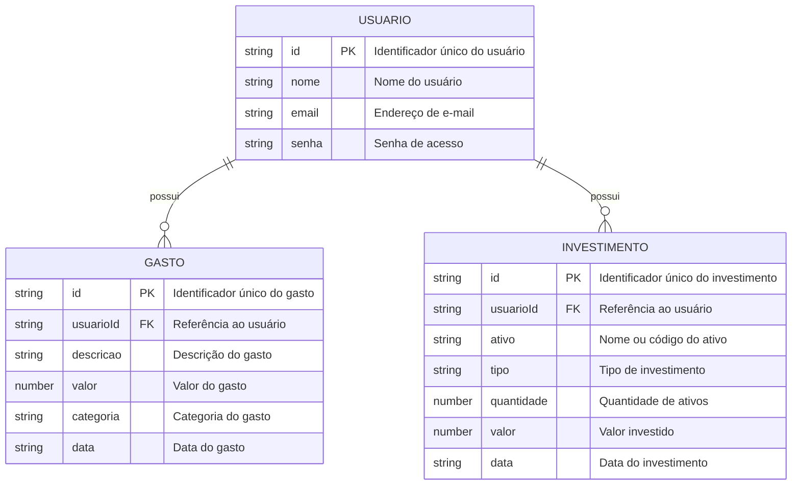

# 🛠️ Especificação Técnica (Tech Spec) - FinanceBook

Este documento descreve a estrutura de dados e as principais tecnologias utilizadas na aplicação **FinanceBook — Livro Financeiro**.

## 1. Modelo de Dados (Diagrama ER)

Abaixo está o Diagrama Entidade-Relacionamento (DER) que representa a estrutura do FinanceBook.



O **Usuário** possui seus registros de **Gastos** e **Investimentos**. Cada registro é vinculado ao usuário por meio do campo `usuarioId`.

As informações de cotação dos ativos **não serão armazenadas no banco de dados**. Esses dados serão obtidos diretamente por meio da **API pública brapi.dev** quando o usuário realizar uma consulta.

---

## 2. Dicionário de Dados

### Usuário

Responsável por armazenar os dados básicos do usuário.

- `id`: identificador único do usuário.
- `nome`: nome do usuário.
- `email`: endereço de e-mail utilizado para identificação.
- `senha`: senha utilizada para autenticação.

### Gasto

Responsável pelo registro das despesas do usuário.

- `id`: identificador único do gasto.
- `usuarioId`: referência ao usuário responsável pelo registro.
- `descricao`: descrição do gasto. Exemplo: **"Supermercado"**.
- `valor`: valor monetário do gasto.
- `categoria`: categoria do gasto. Exemplos: **alimentação, transporte, moradia e lazer**.
- `data`: data em que o gasto foi realizado.

### Investimento

Responsável pelo registro dos investimentos do usuário.

- `id`: identificador único do investimento.
- `usuarioId`: referência ao usuário responsável pelo registro.
- `ativo`: nome ou código do ativo. Exemplos: **PETR4, VALE3 ou BTC**.
- `tipo`: tipo de investimento. Exemplos: **ações, renda fixa, fundos ou criptomoedas**.
- `quantidade`: quantidade de ativos.
- `valor`: valor investido na operação.
- `data`: data em que o investimento foi realizado.

---

## 3. API Pública

O FinanceBook utilizará a **brapi.dev** como API pública para consulta de cotações de ativos.

A API será utilizada como fonte externa de informação para complementar os dados dos investimentos cadastrados pelo usuário.

### Endpoint

```text
GET https://brapi.dev/api/v2/stocks/quote?symbols={ATIVO}
```

Exemplo:

```text
https://brapi.dev/api/v2/stocks/quote?symbols=PETR4
```

### Fluxo

```text
Investimento cadastrado
        ↓
Identificação do ativo
        ↓
Requisição assíncrona para a brapi.dev
        ↓
Recebimento da cotação atual
        ↓
Exibição na aplicação
```

Entre os dados retornados pela API, o sistema poderá utilizar:

- Código do ativo;
- Nome do ativo;
- Cotação atual;
- Variação percentual.

A cotação obtida pela API **não será armazenada como um registro permanente no banco de dados**.

Caso a API esteja indisponível ou ocorra um erro na consulta, o sistema deverá informar o usuário sem comprometer os dados dos investimentos já cadastrados.

Como o projeto possui foco no desenvolvimento front-end, não serão expostos tokens ou outras credenciais diretamente no código da aplicação.

**API:** brapi.dev  
**Endpoint:** `/api/v2/stocks/quote?symbols={ATIVO}`

---

## 4. Tecnologias

- **HTML5**
- **CSS3**
- **Bootstrap 5.3.8**
- **Sass/SCSS**
- **JavaScript ES6+**
- **jQuery**
- **JSON Server**
- **Node.js**
- **NPM**
- **Git**
- **GitHub**