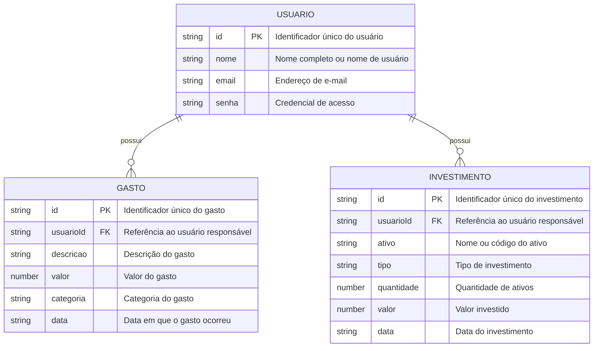

# 🛠️ Especificação Técnica (Tech Spec) - FinanceBook

Este documento descreve o modelo de dados da aplicação **FinanceBook — Livro Financeiro**.

## 1. Modelo de Dados (Diagrama ER)

Abaixo está o Diagrama Entidade-Relacionamento (DER) que representa a estrutura do FinanceBook.

O **Usuário** possui seus registros de **Gastos** e **Investimentos**. Cada gasto e investimento é vinculado a um usuário por meio do campo `usuarioId`.

As informações do **Mercado Financeiro**, como Dólar, Ibovespa e Petróleo, não serão armazenadas no banco de dados. Esses dados serão obtidos por meio de uma **API pública externa** e apresentados na aplicação.

## 2. Dicionário de Dados

Breve explicação das tabelas principais:

- **Usuário:** responsável por armazenar os dados básicos do usuário.
  - `id`: identificador único do usuário.
  - `nome`: nome completo ou nome utilizado pelo usuário.
  - `email`: endereço de e-mail utilizado para identificação do usuário.
  - `senha`: senha utilizada para autenticação.

- **Gasto:** responsável pelo registro das despesas do usuário.
  - `id`: identificador único do gasto.
  - `usuarioId`: referência ao usuário responsável pelo registro.
  - `descricao`: descrição do gasto. Exemplo: **"Supermercado"**.
  - `valor`: valor monetário do gasto.
  - `categoria`: categoria do gasto. Exemplos: **alimentação, transporte, moradia e lazer**.
  - `data`: data em que o gasto foi realizado.

- **Investimento:** responsável pelo registro dos investimentos realizados pelo usuário.
  - `id`: identificador único do investimento.
  - `usuarioId`: referência ao usuário responsável pelo registro.
  - `ativo`: nome ou código do ativo. Exemplos: **PETR4, VALE3 ou BTC**.
  - `tipo`: tipo de investimento. Exemplos: **ações, renda fixa, fundos ou criptomoedas**.
  - `quantidade`: quantidade de ativos adquiridos.
  - `valor`: valor investido na operação.
  - `data`: data em que o investimento foi realizado.

- **Mercado Financeiro:** responsável pela apresentação de informações obtidas por meio de uma **API pública**.
  - **Dólar:** cotação atual do dólar.
  - **Ibovespa:** pontuação ou valor atual do índice Ibovespa.
  - **Petróleo:** cotação atual do petróleo.

## 3. Versões das Tecnologias

- **HTML5**
- **CSS3**
- **Bootstrap:** v5.3.8
- **Sass**
- **JavaScript**
- **jQuery**
- **JSON Server**
- **Node.js**
- **NPM**
- **Git**
- **GitHub**
